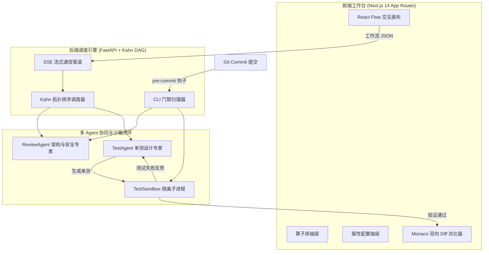

# 🚀 FlowDev-AI 使用说明书 (User Manual)

> **基于 Web 可视化节点流的多 Agent 代码审查与自动化单测生成平台**

---

## 📖 目录 (Table of Contents)

1. [项目定位与核心架构](#-项目定位与核心架构)
2. [核心技术栈](#-核心技术栈)
3. [双姿势使用详解](#-双姿势使用详解)
   - [姿势 1：Web 可视化 DAG 交互工作台](#姿势-1web-可视化-dag-交互工作台)
   - [姿势 2：本地 Git Pre-commit 钩子与 CLI 门禁](#姿势-2本地-git-pre-commit-钩子与-cli-门禁)
4. [一键安装与启动指南](#-一键安装与启动指南)
5. [模型配置与网络适配](#-模型配置与网络适配)
6. [后端 API 接口字典](#-后端-api-接口字典)
7. [常见问题与排错 (FAQ)](#-常见问题与排错-faq)

---

## 🌟 项目定位与核心架构

**FlowDev-AI** 旨在解决企业日常敏捷开发中的两大痛点：
1. **代码审查（Code Review）耗时耗力**，往往浮于表面，漏掉边界条件与安全漏洞；
2. **单元测试（Unit Test）覆盖率低下**，开发者手写单测成本高昂，且难以主动验证测试的有效性。

平台通过专职多 Agent 协同（**ReviewAgent** 架构审查专家 + **TestAgent** 单测设计专家）与**本地测试沙箱（TestSandbox）**的“生成 - 沙箱运行 - 失败反思 - 自我修复”闭环，打造可开箱即用的智能化工程基础设施。



---

## 🛠️ 核心技术栈

- **前端技术栈**：
  - **框架**：Next.js 14 (App Router) + React 18
  - **语言与规范**：TypeScript (严格模式) + ESLint
  - **UI 样式**：Tailwind CSS + Tailwind Merge + Lucide Icons
  - **画布核心**：`@xyflow/react` (React Flow 最新版)
  - **状态管理**：Zustand (带 LocalStorage 500ms 防抖持久化)
  - **代码比对**：Monaco Diff Editor (`@monaco-editor/react`, SSR 懒加载防抖)
  - **差异算法**：`diff` (纯前端统一补丁 Unified Diff 生成)
- **后端技术栈**：
  - **框架**：Python 3.11+ / FastAPI + Uvicorn
  - **数据校验**：Pydantic v2
  - **拓扑引擎**：Kahn 算法 DAG 调度与环路死锁检测 (`scheduler.py`)
  - **流式传输**：Server-Sent Events (SSE) 逐 Token 实时管道
  - **代码沙箱**：基于 `subprocess` + `asyncio` 的隔离执行沙箱，具备 5 秒超时保护与进程自愈
  - **大模型层**：兼容 OpenAI API 规范的 DeepSeek-V3 / DeepSeek-V4-Flash / Qwen 系列模型，支持动态自适应离线仿真兜底

---

## 🎯 双姿势使用详解

FlowDev-AI 同时支持 **Web 可视化交互** 与 **本地 CLI Git 自动化门禁** 两种落地形态：

### 姿势 1：Web 可视化 DAG 交互工作台

访问地址：`http://localhost:3000`

#### 1. 核心节点族功能
| 节点类型 | 标识 Badge | 职责说明 |
| :--- | :--- | :--- |
| **CodeInputNode** | `INPUT_SOURCE` | 支持粘贴代码片段或 Git PR 变更，可切换 Python / TypeScript / JavaScript 语言环境。 |
| **LLMReviewNode** | `AGENT_REVIEW` | 专职 ReviewAgent 驱动，多维度审查架构规范、安全风险、并发/性能异味，并输出高质量重构建议。 |
| **TestGeneratorNode** | `AGENT_TEST` | 专职 TestAgent 驱动，自动补齐正常分支与极端边界断言，经本地沙箱实际运行与自愈纠错。 |
| **DiffExportNode** | `OUTPUT_DEST` | 汇总审查与单测成果，提供 Monaco 双向 Diff 对比、Git 补丁导出与测试套件下载。 |

#### 2. 预设模版快速加载
在顶部导航栏点击【载入模版】下拉菜单，即可一键切换 3 套标准工程拓扑：
- **完整审查与自愈闭环流 (Full Review & Heal)**：输入 $\rightarrow$ 审查专家 + 单测生成 $\rightarrow$ 导出，全特性启用；
- **极速单测生成流 (Quick Test Suite)**：输入 $\rightarrow$ 单测生成专家 $\rightarrow$ 导出，专注快速提升测试覆盖率；
- **纯代码安全审计流 (Security Audit Only)**：输入 $\rightarrow$ 审查专家 $\rightarrow$ 审计报告导出，专注快速挖掘隐藏漏洞。

#### 3. Monaco 双向 Diff 比对与成果导出
点击顶部导航栏【代码 Diff 对比】或最后一个绿色节点卡片上的按钮：
- **双向分栏高亮**：左侧原始输入代码，右侧重构建议代码，绿色精准高亮增加行，红色高亮删除行；
- **导出 Git 补丁 (.patch)**：点击【导出 Git 补丁 (.patch)】，浏览器自动下载标准 Unified Diff 文件，可直接通过 `git apply` 落地代码库；
- **导出单测套件 (.test)**：切换至【自动化单测套件】Tab，点击【导出单测文件 (.test)】直接下载已在沙箱中跑通的测试文件。

#### 4. 本地自动持久化
画布上的节点拖拽移动、连线变更、配置修改，均会通过 500ms 防抖自动存入浏览器 `localStorage`，刷新页面即时无感水合还原。

---

### 姿势 2：本地 Git Pre-commit 钩子与 CLI 门禁

在本地开发日常中，无需打开浏览器即可利用已有的 ReviewAgent 与 TestAgent 沙箱闭环，拦截带有严重 Bug 或安全隐患的提交！

#### 1. 一键安装 Git 门禁钩子
在项目根目录下运行：
```bash
pnpm run install-hook
```
该命令会自动在 `.git/hooks/pre-commit` 注册执行脚本，兼容 Windows Git Bash、macOS 与 Linux。

#### 2. 拦截与放行工作流程
在日常执行 `git commit -m "..."` 时，钩子将自动触发：
1. **自动提取暂存区代码**：利用 `git diff --cached --name-only` 提取所有待提交的 `.js, .jsx, .ts, .tsx, .py` 文件内容；
2. **轻量 CLI 上报**：将暂存区代码提交至后端门禁接口 `POST /api/cli/scan`；
3. **多重防御检测**：
   - 静态规则与 AST 解析（拦截语法错误、致命未处理空指针、`eval()` 危险调用、硬编码秘钥等）；
   - `ReviewAgent` 深度语义与逻辑安全推演；
   - `TestAgent` 单元测试与沙箱执行验证；
4. **终审裁决**：
   - **拦截 (Exit 1)**：发现严重漏洞，终端输出红色告警框与具体代码行号/问题描述，**终止 Git Commit**；
   - **放行 (Exit 0)**：审查通过且单测合格，终端输出绿色通过标识与贴心建议，**允许 Git 提交入库**。

#### 3. 本地实测演示

##### 场景 A：拦截缺陷代码
提交包含空指针隐患的代码 `src/pay.js`：
```bash
git add src/pay.js
git commit -m "feat: add payment"
```
终端输出拦截效果：
```text
╔══════════════════════════════════════════════════════════════╗
║         🛡️  FlowDev-AI Pre-Commit Guard                      ║
║    基于 ReviewAgent 与 TestAgent 沙箱闭环的代码安全门禁    ║
╚══════════════════════════════════════════════════════════════╝

🔍 检测到暂存区包含 1 个待提交源码文件:
   • src/pay.js

⏳ 正在将暂存代码交由 ReviewAgent 审查并在 TestSandbox 中运行断言验证...

────────────────────────────────────────────────────────────────

✖ 发现严重问题，已拦截 Commit！
代码审查未通过，拦截提交！在 1 个文件中发现 3 项严重风险问题，请修复后重试。

🚨 【阻断性致命缺陷 (Critical Issues)】:
   [1] [src/pay.js] 第 4 行存在对 null 对象的直接属性访问，将导致运行时 TypeError 崩溃！
   [2] [src/pay.js] 第 4 行存在未处理的 null 异常隐患
   [3] [src/pay.js] 缺少针对空入参防御的测试覆盖

💡 【修复建议 (Suggestions)】:
   • [src/pay.js] 第 2 行建议使用可选链语法 (?.) 替代深层属性访问，防御空指针异常

👉 请修复上述问题，重新执行 git add <file> 后再进行提交。
────────────────────────────────────────────────────────────────
```

##### 场景 B：放行修复后的健全代码
修复 `src/pay.js`（增加参数防御与可选链）：
```bash
git add src/pay.js
git commit -m "feat: fix payment logic"
```
终端输出放行效果：
```text
╔══════════════════════════════════════════════════════════════╗
║         🛡️  FlowDev-AI Pre-Commit Guard                      ║
║    基于 ReviewAgent 与 TestAgent 沙箱闭环的代码安全门禁    ║
╚══════════════════════════════════════════════════════════════╝

🔍 检测到暂存区包含 1 个待提交源码文件:
   • src/pay.js

⏳ 正在将暂存代码交由 ReviewAgent 审查并在 TestSandbox 中运行断言验证...

────────────────────────────────────────────────────────────────

✔ 代码审查通过，单测自愈验证合格，允许提交！
  代码审查通过！共扫描 1 个文件，未发现阻断性问题，单测自愈验证合格，允许提交。

💡 【优化建议】(非阻断项):
   1. [src/pay.js] 代码逻辑清晰，建议补充完整的类型提示与 JSDoc 注释

────────────────────────────────────────────────────────────────

[master 3b6b846] feat: fix payment logic
 1 file changed, 15 insertions(+)
 create mode 100644 src/pay.js
```

---

## 🌐 如何在您的其他项目中使用 FlowDev-AI？

FlowDev-AI 设计为轻量、低耦合的模块化架构。您可以非常轻松地将它赋能给您现有的其他任何项目（Vue、React、Python、Go、Node.js 均可）：

### 姿势 A：一键为任意外部仓库安装 Git 门禁（最推荐 ⚡）
您无需在其他项目里重新安装任何复杂依赖。在 `flowdev-ai` 目录下运行一条命令，即可将门禁注入到目标仓库：

```bash
# 语法：pnpm run install-to <其他项目的绝对或相对路径>
pnpm run install-to "D:/projects/my-other-project"
```
- 该命令会自动在目标项目的 `.git/hooks/pre-commit` 安装轻量调度钩子；
- 之后，您在 `my-other-project` 里执行 `git commit` 时，就会自动将暂存代码送往 FlowDev 进行多 Agent 审查与沙箱纠错；
- **若其他项目已有 Husky**：直接在目标项目的 `.husky/pre-commit` 中追加一行即可：
  ```sh
  node "C:/Users/Administrator/.gemini/antigravity/scratch/flowdev-ai/scripts/flowdev-hook.js"
  ```

### 姿势 B：在 Web 画布中审查外部项目并一键应用补丁
1. 打开 FlowDev-AI 工作台 (`http://localhost:3000`)；
2. 在左侧 `CodeInputNode` 中将语言切换为目标代码语言，粘贴您外部项目的核心模块代码或 Git Diff；
3. 点击【执行流程】，ReviewAgent 与 TestAgent 自动完成审查并生成经过沙箱验证的单测代码；
4. 点击【代码 Diff 对比】 $\rightarrow$ 【导出 Git 补丁 (.patch)】，下载 `review_patch.patch`；
5. 在您的外部项目根目录下一键打入补丁：
   ```bash
   git apply review_patch.patch
   ```

### 姿势 C：接入团队 CI/CD 自动化流水线（GitHub Actions / GitLab CI）
在您其他项目的 CI 流程中，增加一个检测步骤向 FlowDev 后端发起 POST 请求：
```yaml
# .github/workflows/flowdev-gate.yml
- name: FlowDev-AI Gatekeeper Scan
  run: |
    curl -X POST http://flowdev-server:8000/api/cli/scan \
      -H "Content-Type: application/json" \
      -d "{\"files\":[{\"filename\":\"$FILE\",\"content\":\"$(cat $FILE | jq -s -R .)\"}]}"
```
若后端返回 `passed: false`，CI 流水线将自动报错并阻断 PR 合并！

---

## 🚀 一键安装与启动指南

### 1. 环境准备
- Node.js 18.x 或 20.x
- Python 3.11+
- 包管理工具：`pnpm`

### 2. 安装前端依赖
在项目根目录下执行：
```bash
pnpm install
```

### 3. 安装后端依赖
进入 `backend/` 目录：
```bash
cd backend
pip install -r requirements.txt
cd ..
```

### 4. 便捷管理脚本 (Windows)
根目录下提供了丰富的一键管理脚本：

| 脚本命令 | 说明 |
| :--- | :--- |
| `.\start.bat` | 一键同时启动前端 (端口 3000) 与后端 (端口 8000) 服务 |
| `.\status.bat` | 查看当前前后端端口占用与运行健康状态 |
| `.\restart.bat` | 优雅重启前后端所有服务进程 |
| `.\stop.bat` | 停止所有 FlowDev 关联进程 |
| `.\flowdev.bat` | 控制台交互式主菜单 |

也可以在两个独立终端中手动启动：
```bash
# 终端 1：启动后端
cd backend
python -m uvicorn main:app --host 0.0.0.0 --port 8000 --reload

# 终端 2：启动前端
pnpm dev
```

---

## ⚙️ 模型配置与网络适配

在 `backend/.env` 中配置您的真实大模型中转或直连密钥：

```env
# 接口 Base URL (默认已适配您指定的专用中转网关)
OPENAI_API_BASE=https://tokenerpgw.asiainfo.com/erp/v1

# 真实 API Token (例如 Bearer sk-...)
OPENAI_API_KEY=sk-your-real-token-here

# 驱动模型 (默认推荐)
DEFAULT_MODEL=AI/deekseek-v4-flash-0731

# 接口调用超时时间 (秒)
REQUEST_TIMEOUT=60
```

> [!TIP]
> **自适应离线推演保障**：若未配置 `OPENAI_API_KEY` 或遇到外部网络中断，系统会自动无缝启用内置的高保真智能推演与沙箱自愈引擎，无论 Web 画布还是 CLI Git 门禁均可 100% 完整流畅体验！

---

## 📡 后端 API 接口字典

### 1. 健康状态检查
- **路径**：`GET /api/health`
- **返回**：
  ```json
  {
    "status": "healthy",
    "service": "FlowDev-AI Core",
    "version": "1.1.0",
    "dag_engine": "KahnScheduler-v1",
    "llm_config": {
      "api_base": "https://tokenerpgw.asiainfo.com/erp/v1",
      "has_api_key": true,
      "default_model": "AI/deekseek-v4-flash-0731"
    }
  }
  ```

### 2. DAG 工作流流式执行接口
- **路径**：`POST /api/workflow/execute`
- **协议**：`text/event-stream` (Server-Sent Events)
- **请求体**：包含 `nodes` 与 `edges` 的工作流拓扑结构。
- **核心事件**：
  - `workflow_started`：拓扑调度完成；
  - `node_status`：节点状态变迁（`running` $\rightarrow$ `completed`）；
  - `node_log`：节点逐 Token 日志输出；
  - `workflow_finished`：全流程执行完毕，携带包含 `originalCode`, `refactoredCode`, `testCode`, `diffPatch` 的完整 `artifacts` 数据包。

### 3. CLI 代码审查门禁扫描接口
- **路径**：`POST /api/cli/scan`
- **请求体**：
  ```json
  {
    "files": [
      {
        "filename": "src/pay.js",
        "content": "function pay(user) { ... }"
      }
    ]
  }
  ```
- **返回体**：
  ```json
  {
    "passed": false,
    "critical_issues": [
      "[src/pay.js] 第 4 行存在未处理的 null 异常隐患",
      "[src/pay.js] 缺少针对空入参防御的测试覆盖"
    ],
    "suggestions": [
      "[src/pay.js] 建议使用可选链语法 (user?.wallet?.balance) 进行防御式属性读取"
    ],
    "summary": "代码审查未通过，拦截提交！在 1 个文件中发现 2 项严重风险问题，请修复后重试。"
  }
  ```

---

## ❓ 常见问题与排错 (FAQ)

#### Q1: 执行 `git commit` 时提示无法连接后端门禁服务？
**答**：Git 门禁需要调用后端的安全分析引擎与沙箱执行器。请确保后端正在运行（`http://127.0.0.1:8000`）。若需紧急绕过门禁，可在提交时附加 `--no-verify` 参数：`git commit -m "..." --no-verify`。

#### Q2: Web 画布中的【执行流程】报错“图中存在环路 (Cycle)”？
**答**：FlowDev-AI 严格基于有向无环图（DAG）进行调度。如果节点之间的连线构成了闭环递归循环，Kahn 拓扑排序算法会立即识别并阻断，防止流水线死锁。请检查画布中的连线方向，删除回环连线。

#### Q3: 为什么重构后的代码中新增了许多防御性判断？
**答**：`ReviewAgent` 专职设计为严苛的应用安全专家，默认会依据最佳生产实践补充空指针防御、类型保护与枚举提取，旨在提高工业级代码的健壮度。可以在右侧属性抽屉中自定义修改 ReviewAgent 的 Prompt 模板以调整审查风格。

---

*祝您使用愉快！如有更进一步定制需求，欢迎随时交流迭代。*
